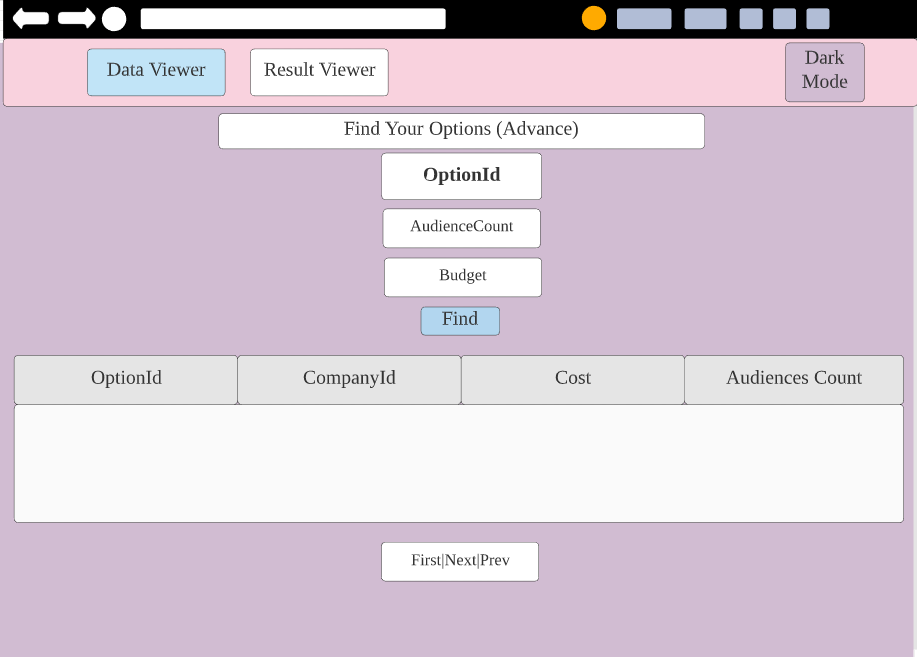
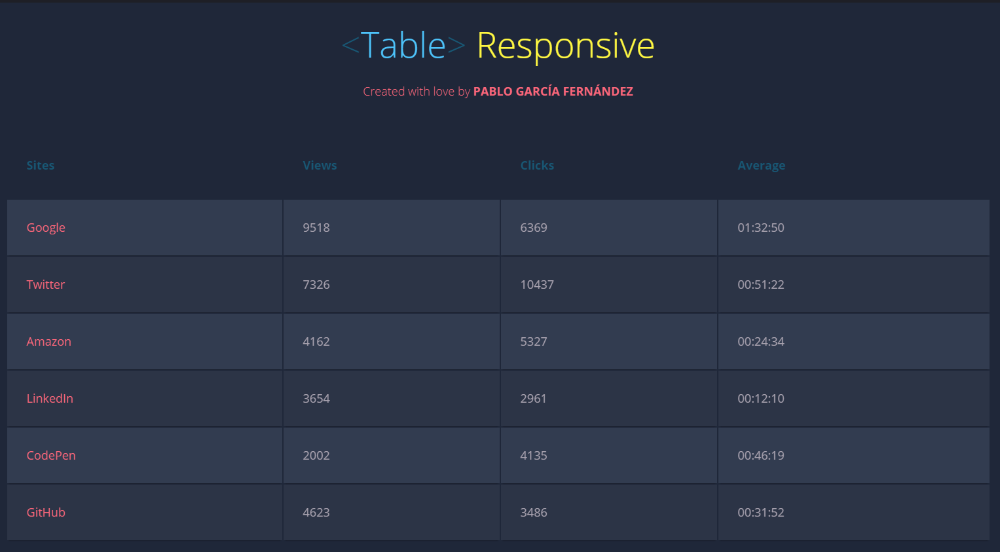
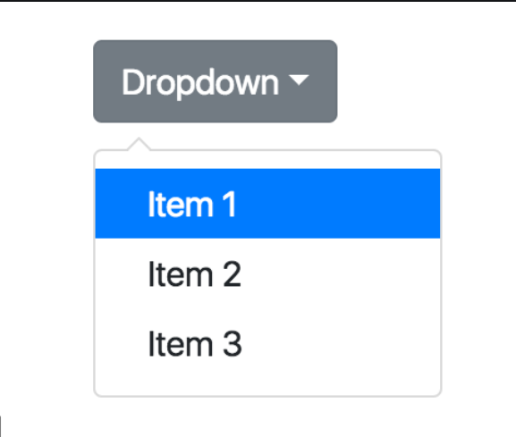
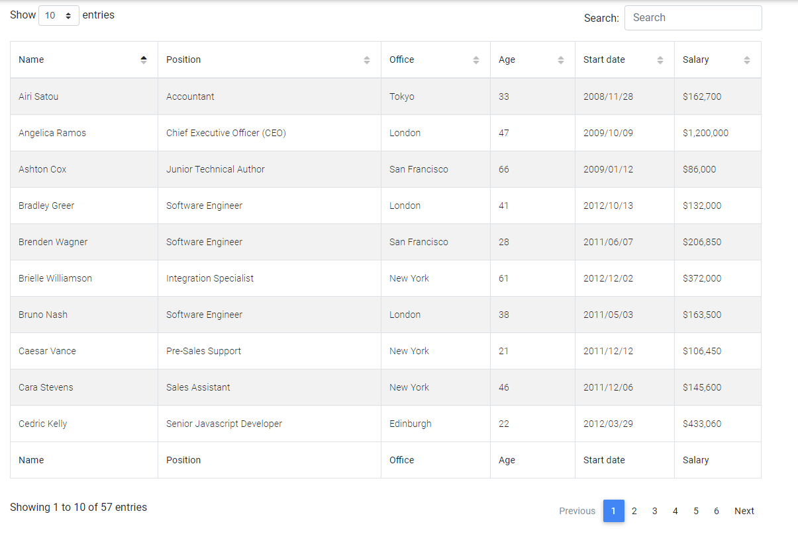

# Wireframe & Justification

This document should help you explain how your user interfaces are designed. You should have a wireframe to give a good overview and some screenshot with simple writeups to justify your designs.

## Wireframe

## Justifications

### Justification 1

Link for Justification 1: 

https://codepen.io/heypablete/full/qdIsm

#### Good Points

1. Clean and Clear Display of the data
2. Have dark mode. (Might do a white and dark mode for users.)

#### Bad Points

1. If there happens to be many columns, it might be not be pleasant for the user to view it as a whole in the website.
2. The column headers and the content should have a brighter color when it is in dark mode.
3. Dark Mode may be challenging.

### Justification 2

Link for Justification 2:

https://www.abeautifulsite.net/adding-tips-to-bootstrap-4-dropdown-menus

#### Good Points

1. This dropdown can be used for ``companyId``. Through this, the user will never input an empty or error value which will be a pleasant experience for both the user and developer.

#### Bad Points

1. There are only three items that can be used for dropdown. (Have to extend)
2. If there are too many companies, the dropdown might look cluttered, hence difficult to navigate.

### Justification 3

Link for Justification 3:

https://mdbootstrap.com/docs/jquery/tables/datatables/

#### Good Points

1. The pagination system in the image fulfills all the requirements for this project.
2. It shows the number of entries in 1 page out of the total entries, which may be useful for the viewers.
3. When the user scrolls down the page, they may forget what the columns are meant for. So, a bottom description will be useful in this case.

#### Bad Points

1. Might be difficult to implement especially for the (1, 2, 3, 4, 5, etc.)
2. Page Size is quite difficult to reach as it is at the top right. It would be better if it is aligned together with the page numbers in the bottom right corner.