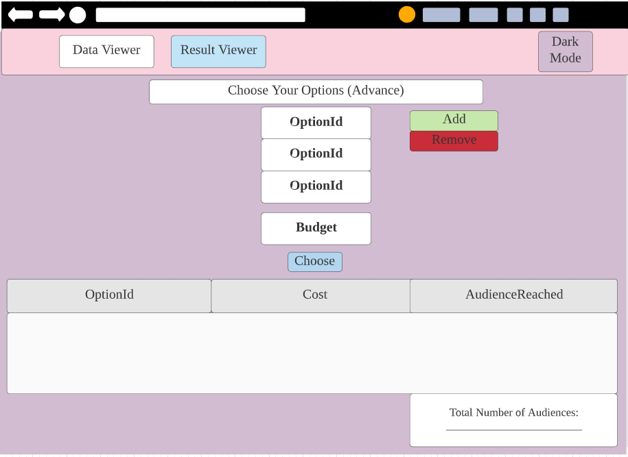
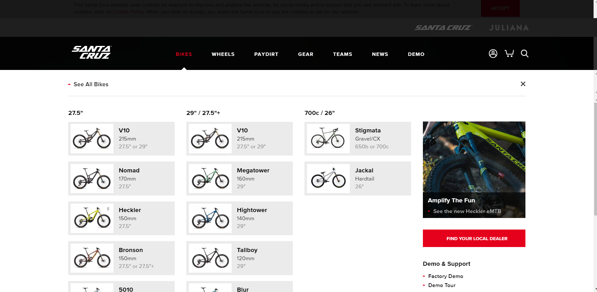
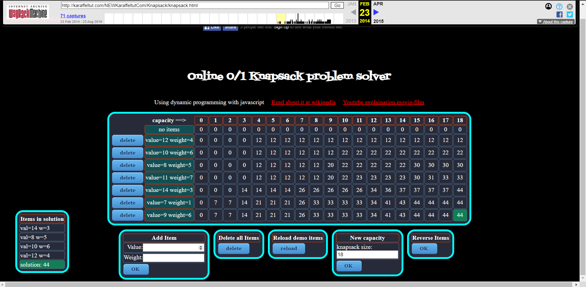

# Wireframe & Justification

This document should help you explain how your user interfaces are designed. You should have a wireframe to give a good overview and some screenshot with simple writeups to justify your designs.

## Wireframe

## Justifications

### Justification 1

Link for Justification 1: 

https://cristianabrante.github.io/GeneticsJsKnapsack/ 

#### Good Points

1. Nice looking UI.
2. Highlights the best options using contrasting colours to make it stand out (green for best options and yellow on options that are not chosen to match the background).

#### Bad Points

1. Uses different algorithm so there are irrelevent things on the webpage.
2. May be hard to implement.

### Justification 2

Link for Justification 2: 

https://www.santacruzbicycles.com/en-US

#### Good Points

1. Dropdown menu allows users to see all bicycle options, which is useful for our website as the user will not have to type out the whole option id.

#### Bad Points

1. May be difficult to implement.
2. Having too many ids in dropdown may be too cluttered for the user.

### Justification 3

Link for Justification 3: 

https://web.archive.org/web/20140223114908/http://karaffeltut.com/NEWKaraffeltutCom/Knapsack/knapsack.html

#### Good Points

1. Allows users to input approriate data into a table.
2. Able to easily understand and use the website.
3. Makes the final solution stand out using contrasting colours (green on black background)

#### Bad Points

1. UI looks outdated.
2. Colours do not look pleasing (Red links look glaring on black background).
3. Font sizes are small.
